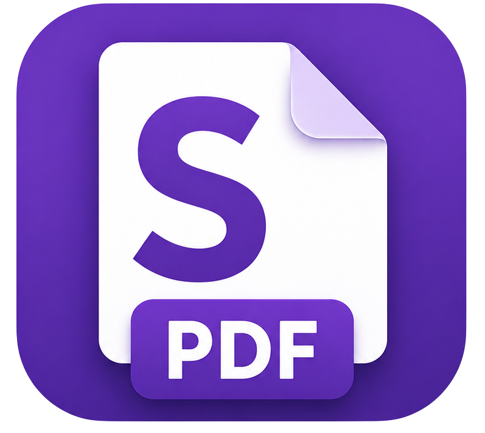

<div align="center">
  
  <h1>SlackPDF</h1>
  <p>Быстрый, бесплатный, open-source инструмент для работы с PDF на Windows</p>

  [](https://github.com/kichnap/slackpdf/actions)
  [](LICENSE)
  [](https://github.com/kichnap/slackpdf/releases/latest)
  [](https://github.com/kichnap/slackpdf/releases)

  **[🇬🇧 Read in English](README.en.md)**
</div>

---

## Возможности

| Модуль | Описание |
|---|---|
| **Объединить** | Склеить PDF с выбором диапазонов страниц, обработкой закладок, AcroForms и оглавлением |
| **Разделить** | Разбить по страницам, каждые N страниц, по номерам, по размеру файла или по закладкам |
| **Чередование** | Перемежать страницы из нескольких PDF — идеально для односторонних сканов |
| **Поворот** | Повернуть все, чётные, нечётные или выбранные страницы на 90 / 180 / 270° |
| **Извлечь** | Извлечь отдельные страницы или диапазоны в новый PDF |
| **Вставить** | Вставить один PDF внутрь другого в заданную позицию или с заданной периодичностью |
| **Визуальный сборщик** ⭐ | Перетаскивай миниатюры страниц из нескольких документов и собирай новый PDF в произвольном порядке |

## Скачать

👉 **[Последний релиз](https://github.com/kichnap/slackpdf/releases/latest)** — скачать `SlackPDF-Setup-x.x.x.exe`

Windows 10 / 11 x64. Установка .NET не требуется (self-contained).

## Сборка из исходников

**Требования:** [.NET 9 SDK](https://dotnet.microsoft.com/download/dotnet/9.0), Windows 10/11 x64

```bash
git clone https://github.com/kichnap/slackpdf.git
cd slackpdf
dotnet restore
```

### Быстрый запуск (разработка)

Запускает приложение напрямую, без упаковки. Самый быстрый способ проверить изменения.

```bash
dotnet run --project src/SlackPDF
```

### Сборка (debug)

Компилирует в `src/SlackPDF/bin/Debug/net9.0-windows/win-x64/`. Self-contained — установленный .NET не нужен.

```bash
dotnet build
```

### Сборка (release)

Компилирует в `src/SlackPDF/bin/Release/net9.0-windows/win-x64/`. Self-contained, с оптимизациями.

```bash
dotnet build -c Release
```

### Публикация — для дистрибуции

Создаёт один автономный `SlackPDF.exe` в папке `publish/`. Используется для сборки инсталлятора.

```bash
dotnet publish src/SlackPDF/SlackPDF.csproj -c Release -o publish/
```

> Все параметры (`self-contained`, `win-x64`, `PublishSingleFile`) уже заданы в `.csproj` — дублировать их в командной строке не нужно.

### Запуск тестов

```bash
dotnet test
```

### Сборка инсталлятора (требует [Inno Setup 6](https://jrsoftware.org/isinfo.php))

Сначала выполни публикацию (см. выше), затем:

```bash
# Если Inno Setup добавлен в PATH:
iscc installer/SlackPDF.iss

# Или через полный путь:
& "C:\Program Files (x86)\Inno Setup 6\ISCC.exe" installer\SlackPDF.iss

# Результат: installer/Output/SlackPDF-Setup-1.0.0.exe
```

Либо используй скрипт, который делает publish + installer за один шаг:

```powershell
.\build.ps1
```

## Зачем SlackPDF?

- **Бесплатно навсегда** — GPL v3, без рекламы, без телеметрии, без облака
- **Визуальный сборщик** — уникальная сборка документа перетаскиванием миниатюр, которой нет в PDFsam
- **Быстро** — операции над страницами копируют потоки PDF как есть, без перекодирования графики
- **Легко** — минимум зависимостей, один исполняемый файл

## Участие в разработке

PR и issues приветствуются! См. [CONTRIBUTING.md](docs/CONTRIBUTING.md).

## Используемые компоненты

Все компоненты распространяются под лицензией MIT и совместимы с GPL v3.

| Компонент | Назначение | Лицензия |
|---|---|---|
| [PDFsharp](https://github.com/empira/PDFsharp) | Чтение и запись PDF | MIT |
| [PDFtoImage](https://github.com/sungaila/PDFtoImage) | Рендеринг страниц в миниатюры | MIT |
| [SkiaSharp](https://github.com/mono/SkiaSharp) | Графический рендеринг | MIT |
| [MaterialDesignThemes](https://github.com/MaterialDesignInXAML/MaterialDesignInXamlToolkit) | UI-компоненты и тема | MIT |
| [CommunityToolkit.Mvvm](https://github.com/CommunityToolkit/dotnet) | MVVM-инфраструктура | MIT |

## Лицензия

[GNU GPL v3](LICENSE) © SlackPDF Contributors
